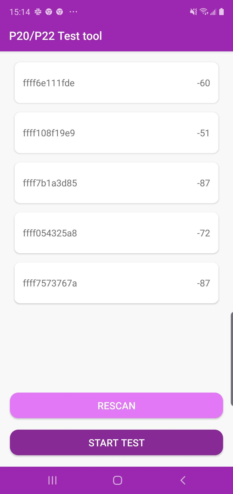
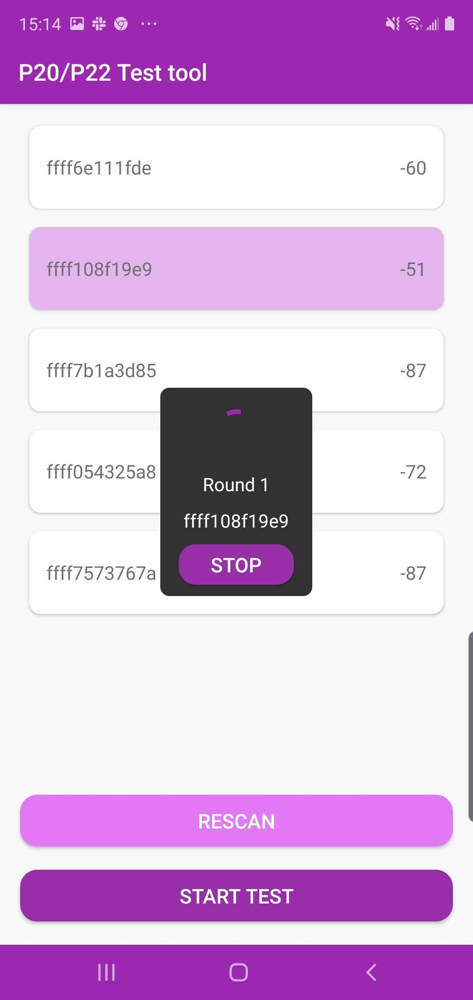

# secux-paymentdevicekit-v2

[](https://jitpack.io/#secuxtech/secux-paymentdevicekit-v2-android)


## Requirements

* Minimum SDK Version: 24

### Add JitPack repository

```java
allprojects {
    repositories {
        ...
        maven { url 'https://jitpack.io' }
    }
}
```

### Add dependency secux-paymentkit-android

```java
dependencies {
    implementation 'com.github.secuxtech:secux-paymentdevicekit-v2-android:{version}'
}
```
### Add bluetooth privacy permissions

Add permission to the AndroidManifest.xml

    <uses-permission android:name="android.permission.BLUETOOTH"/>
    <uses-permission android:name="android.permission.BLUETOOTH_ADMIN"/>
    <uses-permission android:name="android.permission.INTERNET"/>
    <uses-permission android:name="android.permission.ACCESS_COARSE_LOCATION"/>
    <uses-permission android:name="android.permission.ACCESS_FINE_LOCATION"/>

Request permission

```java
    if (Build.VERSION.SDK_INT >= Build.VERSION_CODES.M) {
        if (this.checkSelfPermission(Manifest.permission.ACCESS_FINE_LOCATION) != PackageManager.PERMISSION_GRANTED) {
            requestPermissions(new String[]{Manifest.permission.ACCESS_FINE_LOCATION}, 1);
        }
    }
```

### Import the the module

```java 
import com.secuxtech.paymentkit.*;
```

## Usage

1. <b>PaymentPeripheralManager initialization</b>

public PaymentPeripheralManager(Context context, int scanTimeout, int checkRSSI, final int connectionTimeout)

#### <u>Parameters</u>
```
    context:            Current acitvity's context
    scanTimeout:        Timeout in seconds for device scan
    connectionTimeout:  Timeout in seconds for connection with device
    checkRSSI:          Scan device within the RSSI value
```

#### <u>Sample</u>
```java
    PaymentPeripheralManager peripheralManager = new PaymentPeripheralManager(mContext, 
                                                                            10, -80, 30);
```

2. <b>Get device payment ivKey</b>

Get the payment ivKey from the payment device.

<span style="color:red">Note: Call the function in thread. You are allowed to cancel the payment after getting
    the ivKey. </span>

* <b>2.1 Get device payment ivKey from device ID</b>

#### <u>Declaration</u>
```java
    public Pair<Integer, String> doGetIVKey(String connectDeviceId)
```

#### <u>Parameters</u>
```
    connectDeviceId: Device ID, e.g. "811c00000016"
```

* <b>2.2 Get device payment ivKey from device ID and payment nonce</b>

This is recommended to get the ivKey when using P22. Payment nonce can garantee the payment correctness.

#### <u>Declaration</u>
```java
    public Pair<Integer, String> doGetIVKey(String connectDeviceId, byte[] nonce)
```

#### <u>Parameters</u>
```
    connectDeviceId: Device ID, e.g. "811c00000016"
    nonce: Payment nonce from payment QR code, convert the nonce hex string to byte array

    Payment QR code sample:
    {"amount":"5", "coinType":"DCT:SPC", "nonce":"e956013c", 
    "deviceIDhash":"b0442888f1c9ddb5bb924382f44b0f025e0dc7cd"}
```

#### <u>Return value</u>
```
    Returned integer value shows the operation result, if the result is  
    SecuX_Peripheral_Operation_OK, the returned String contains device's ivKey, 
    otherwise String might contain an error message.  
```

#### <u>Error message</u>
```
    - Can't find device
    - Invalid payment QRCode! QRCode is timeout!
    - Inactivated device!
    - Set connection timeout failed!
```

#### <u>Sample</u>
```java
    byte[] nonce = SecuXPaymentUtility.hexStringToData(nonceStr);
    Pair<Integer, String> getIVKeyret = peripheralManager.doGetIVKey(devID, nonce);
    String ivKey = "";
    if (getIVKeyret.first == SecuX_Peripheral_Operation_OK) {
        ivKey = getIVKeyret.second;
        Log.i(TAG, "ivKey=" + ivKey);
    } else {
        Log.i(TAG, "Payment failed! Get ivKey failed " + getIVKeyret.second);
    }
```

3. <b>Cancel Payment</b>

Call the function after getting payment ivKey, will cancel the payment.

#### <u>Declaration</u>
```java
    void requestDisconnect()
```

4. <b>Do payment</b>

Send the encrypted payment data to the device to confirm the payment.

<span style="color:red">Note: call the function in thread.</span>

#### <u>Declaration</u>
```java
    Pair<Integer, String>  doPaymentVerification(byte[] encryptedTransactionData)
```

#### <u>Parameters</u>
```
    encryptedTransactionData: The encrypted payment data.

    To generate encrypted payment data, please refer to the 
    getEncryptMobilePaymentCommand in BaseActivity.java in paymentdeviceexample.
```

```java
    byte[] getEncryptMobilePaymentCommand(String terminalId, String amount, String 
                                         currency, String ivKey, String cryptKey)

    if (peripheralManager.isOldFWVersion()){
        //For Payment device with FW 1.0
        
        final byte[] encryptedData = getEncryptMobilePaymentCommand(devID.substring(devID.length() - 8, 
                                devID.length()), 
                                amount, 
                                "IFC",
                                ivKey, 
                                "PA123456789012345678901234567890");

        ...
        
    }else{
        //For Payment device with FW 2.0+
        
        final byte[] encryptedData = getEncryptMobilePaymentCommand(mTerminalID, 
                                                        amount, 
                                                        "DCT:IFC", 
                                                        ivKey, 
                                                        mPaymentKey);

        ...
    
    }
```

#### <u>Return value</u>
```
    Returned integer value shows the operation result, if the result is  
    SecuX_Peripheral_Operation_OK, payment is successful, 
    otherwise String might contain an error message.  

    Note: call the function in thread.
```

#### <u>Sample</u>
```java
    if (peripheralManager.isOldFWVersion()){
        try {
            JSONObject ioCtrlParamJson = new JSONObject("{\"uart\":\"0\",\"gpio1\":\"0\",\"gpio2\":\"0\",\"gpio31\":\"0\",\"gpio32\":\"0\",\"gpio4\":\"0\",\"gpio4c\":\"0\",\"gpio4cInterval\":\"0\",\"gpio4cCount\":\"0\",\"gpio4dOn\":\"0\",\"gpio4dOff\":\"0\",\"gpio4dInterval\":\"0\",\"runStatus\":\"0\",\"lockStatus\":\"0\"}");

            final MachineIoControlParam machineIoControlParam = new MachineIoControlParam();
            machineIoControlParam.setGpio1(ioCtrlParamJson.getString("gpio1"));
            machineIoControlParam.setGpio2(ioCtrlParamJson.getString("gpio2"));
            machineIoControlParam.setGpio31(ioCtrlParamJson.getString("gpio31"));
            machineIoControlParam.setGpio32(ioCtrlParamJson.getString("gpio32"));
            machineIoControlParam.setGpio4(ioCtrlParamJson.getString("gpio4"));
            machineIoControlParam.setGpio4c(ioCtrlParamJson.getString("gpio4c"));
            machineIoControlParam.setGpio4cCount(ioCtrlParamJson.getString("gpio4cCount"));
            machineIoControlParam.setGpio4cInterval(ioCtrlParamJson.getString("gpio4cInterval"));
            machineIoControlParam.setGpio4dOn(ioCtrlParamJson.getString("gpio4dOn"));
            machineIoControlParam.setGpio4dOff(ioCtrlParamJson.getString("gpio4dOff"));
            machineIoControlParam.setGpio4dInterval(ioCtrlParamJson.getString("gpio4dInterval"));
            machineIoControlParam.setUart(ioCtrlParamJson.getString("uart"));
            machineIoControlParam.setRunStatus(ioCtrlParamJson.getString("runStatus"));
            machineIoControlParam.setLockStatus(ioCtrlParamJson.getString("lockStatus"));

            Pair<Integer, String> ret = peripheralManager.doPaymentVerification
                                        (encryptedData, machineIoControlParam);
            if (ret.first != 0) {
                Log.i(TAG, "Payment failed! " + ret.second);
            } else {
                Log.i(TAG, "Payment done");
                
            }
        } catch (Exception e) {
            Log.i(TAG, "Generate io configuration failed!");
        }
    }else{
        Pair<Integer, String> ret = peripheralManager.doPaymentVerification
                                    (encryptedData);
        if (ret.first != SecuX_Peripheral_Operation_OK) {
            Log.i(TAG, "Payment failed! " + ret.second);
            //showMessageInMain("Payment failed! " + ret.second);
        } else {
            Log.i(TAG, "Payment done");
            
        }
    }
```


# secux-paymentdevicekit-v2 Sample

Source code of the secux-paymentdevicekit-v2. Also contains the test tool for payment device

## Screenshot of the test tool

<p float="center">


</p>

## Author

SecuX, maochunsun@secuxtech.com

## License

SecuXPaymentKit is available under the MIT license.
